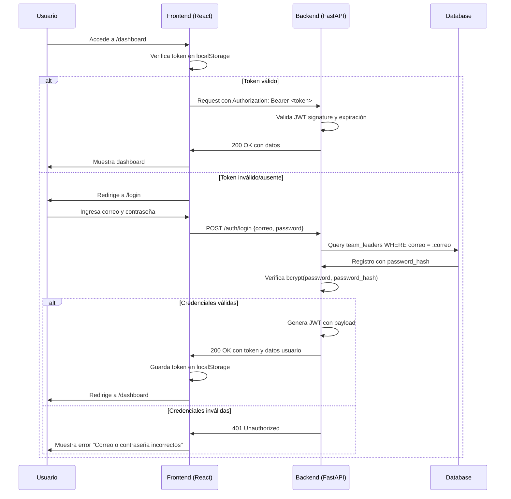

# Feature: Sistema de Autenticación JWT para Pegasus

## Resumen Ejecutivo
Implementar un sistema de autenticación seguro basado en JWT (JSON Web Tokens) para el dashboard Pegasus, reemplazando la API key estática actual (`mvp-test-key-123`) por autenticación por usuario y contraseña con tokens de sesión de 8 horas.

## Contexto de Negocio
Actualmente el dashboard es accesible sin autenticación de usuarios, solo con una API key hardcodeada. Esto representa un riesgo de seguridad y no permite diferenciar entre administradores y team leaders. La nueva autenticación permitirá:

1. **Control de acceso**: Solo usuarios autorizados pueden acceder al sistema
2. **Auditoría**: Trazabilidad de acciones por usuario
3. **Roles**: Base para futura implementación de permisos diferenciados
4. **Seguridad**: Eliminación de clave estática comprometida

## Alcance

### ✅ Incluido
- Login con correo electrónico y contraseña
- Tokens JWT con expiración de 8 horas
- Protección de todas las rutas del dashboard
- Protección de endpoints de la API
- Usuarios iniciales: 1 administrador + 5 team leaders (uno por clan)
- Hash de contraseñas con bcrypt (cost=12)
- Logout automático por expiración
- Mostrar nombre del usuario en navbar

### ❌ Excluido (Sprints futuros)
- Recuperación de contraseña por email
- Bloqueo de cuenta por intentos fallidos
- Autenticación de dos factores (2FA)
- Cambio de contraseña obligatorio en primer login
- Roles diferenciados (todos ven todos los clanes por ahora)

## Especificación Técnica

### Stack Tecnológico
| Componente | Tecnología | Justificación |
|------------|------------|---------------|
| Hash contraseñas | `passlib[bcrypt]` (cost=12) | Standard industry, resistente a fuerza bruta |
| Firma JWT | `python-jose[cryptography]` (HS256) | Compatible, bien mantenido |
| Contexto frontend | React Context API (`AuthContext`) | Simple, sin dependencias externas |
| Almacenamiento token | `localStorage` (`pegasus_token`) | Standard para SPAs |
| Rutas protegidas | Componente `<ProtectedRoute>` | Control declarativo de acceso |

### Nuevas Dependencias
```txt
# api/requirements.txt (agregar)
python-jose[cryptography]==3.3.0
passlib[bcrypt]==1.7.4
```

### Variables de Entorno
```env
# .env (agregar, NO committear)
JWT_SECRET=<clave-aleatoria-256-bits>
JWT_ALGORITHM=HS256
JWT_EXPIRE_HOURS=8
```

### Modelo de Datos - Tabla `team_leaders`
La tabla ya está definida en `api/app/db/models.py` pero requiere migración para crearse en la DB de producción.

**Campos:**
- `id` INTEGER PK
- `nombre` VARCHAR(100) NOT NULL
- `correo` VARCHAR(100) UNIQUE NOT NULL
- `password_hash` VARCHAR(255) NOT NULL
- `rol` VARCHAR(50) NOT NULL → valores: `"admin"` | `"team_leader"`
- `clan_id` INTEGER FK → `clanes.id` NULLABLE (admin puede no tener clan)

### Endpoint de Autenticación

#### `POST /api/v1/auth/login`
**Request:**
```json
{
  "correo": "tl.hamilton@selvadescriptiva.com",
  "password": "MiClave2026"
}
```

**Response 200 OK:**
```json
{
  "access_token": "eyJhbGciOiJIUzI1NiIsInR5cCI6IkpXVCJ9...",
  "token_type": "bearer",
  "expires_in": 28800,
  "usuario": {
    "nombre": "Juan Pérez",
    "correo": "tl.hamilton@selvadescriptiva.com",
    "rol": "team_leader",
    "clan": "Hamilton"
  }
}
```

**Response 401 Unauthorized:**
```json
{
  "detail": "Correo o contraseña incorrectos"
}
```

### Payload del Token JWT
```json
{
  "sub": "tl.hamilton@selvadescriptiva.com",
  "nombre": "Juan Pérez",
  "rol": "team_leader",
  "clan_id": 1,
  "exp": 1744747200,  // UNIX timestamp + 8 horas
  "iat": 1744718400
}
```

### Reglas de Negocio

| ID | Regla | Implementación |
|----|-------|----------------|
| RN-1 | Correo electrónico case-insensitive | `lower(correo)` en validación |
| RN-2 | Contraseña mínima: 8 chars, 1 número, 1 mayúscula | Validación en frontend/backend |
| RN-3 | Token expira a 8 horas (jornada laboral) | `exp` claim en JWT |
| RN-4 | Team leader pertenece a un único clan | FK `clan_id` en tabla |
| RN-5 | Password hash nunca en respuestas JSON | Excluir campo de serialización |
| RN-6 | Credenciales primera vez asignadas manualmente | Script seed `init_team_leaders.py` |

### Flujo de Autenticación



## Arquitectura de Cambios

### Backend (`api/`)
```
api/
├── app/
│   ├── api/
│   │   ├── endpoints/
│   │   │   └── auth.py              # NUEVO: Endpoint /auth/login
│   │   ├── dependencies.py          # MODIFICAR: agregar verify_jwt_token()
│   │   └── router.py               # MODIFICAR: incluir auth_router
│   ├── core/
│   │   ├── security.py             # NUEVO: funciones JWT y bcrypt
│   │   └── repositories/
│   │       └── auth_repository.py  # NUEVO: lógica de autenticación
│   └── db/
│       └── models.py               # YA TIENE: modelo TeamLeader
├── migrations/
│   └── versions/
│       └── XXXXXX_create_team_leaders.py  # NUEVA migración
├── scripts/
│   └── init_team_leaders.py        # NUEVO: script seed usuarios
└── requirements.txt                # MODIFICAR: agregar dependencias
```

### Frontend (`web/`)
```
web/src/
├── context/
│   └── AuthContext.jsx             # NUEVO: estado global de autenticación
├── pages/
│   └── LoginPage.jsx               # NUEVO: formulario de login
├── components/
│   ├── ProtectedRoute.jsx          # NUEVO: wrapper para rutas privadas
│   └── Navbar.jsx                  # MODIFICAR: agregar usuario y logout
├── services/
│   └── api.js                      # MODIFICAR: usar JWT en vez de API key
└── App.jsx                         # MODIFICAR: envolver en AuthContext
```

## Criterios de Aceptación (DoD)

### Backend
- [ ] Endpoint `/auth/login` retorna JWT con datos de usuario
- [ ] Contraseñas hasheadas con bcrypt (verificable en DB)
- [ ] Token JWT expira a las 8 horas (28800 segundos)
- [ ] Tabla `team_leaders` existe en DB de producción
- [ ] Dependencias `python-jose` y `passlib` instaladas
- [ ] `JWT_SECRET` configurado en variables de entorno (no en código)
- [ ] Endpoints existentes protegidos con JWT (mantener API key como fallback)

### Frontend
- [ ] Ruta `/login` muestra formulario funcional
- [ ] Sin token válido, redirige automáticamente a `/login`
- [ ] Token se guarda en localStorage como `pegasus_token`
- [ ] Navbar muestra nombre del usuario logueado
- [ ] Botón "Cerrar sesión" elimina token y redirige a login
- [ ] Request a API incluyen header `Authorization: Bearer <token>`
- [ ] Manejo automático de expiración de token (redirige a login)

### Seguridad
- [ ] Contraseñas nunca viajan en respuestas de API
- [ ] Password hash no aparece en JSON responses
- [ ] Campo contraseña siempre de tipo `password` en formularios
- [ ] Mensajes de error genéricos ("Correo o contraseña incorrectos")
- [ ] Token firmado con HS256 usando secreto de 256 bits

## Riesgos y Mitigaciones

| Riesgo | Impacto | Mitigación |
|--------|---------|------------|
| Token comprometido | Alto | Expiración corta (8h), uso de HTTPS en producción |
| DB sin tabla team_leaders | Alto | Verificar antes de deploy, migración automática |
| Compatibilidad con scripts existentes | Medio | Mantener API key temporalmente, logging de deprecated |
| Frontend sin React Router | Medio | Implementar routing básico para login/dashboard |
| Secret en código fuente | Crítico | Variables de entorno, .env en .gitignore, secrets management |

## Métricas de Éxito
- **Tiempo de implementación**: ≤ 3 días de desarrollo
- **Coverage de testing**: ≥ 80% para nuevos módulos auth
- **Performance**: Login response < 500ms
- **Usabilidad**: Usuarios pueden loguearse en ≤ 2 intentos
- **Seguridad**: Zero credenciales hardcodeadas en producción

## Notas de Implementación

### Compatibilidad con API Key Heredada
Los endpoints actuales usan `X-API-Key`. Durante la transición:
1. Mantener verificación de API key como fallback para scripts existentes
2. Loggear warnings cuando se use API key (deprecation)
3. Eliminar gradualmente en sprint siguiente

### Usuarios Iniciales
Script `init_team_leaders.py` creará 6 usuarios con contraseñas temporales:
- Admin: `admin@selvadescriptiva.com` (sin clan)
- Team Leaders: `tl.<clan>@selvadescriptiva.com` (uno por clan)

Contraseñas temporales: `TempPass2026!` (deben cambiarse en primer login - futuro)

### Próximas Mejoras
1. **Sprint 2**: Cambio de contraseña obligatorio en primer login
2. **Sprint 3**: Recuperación de contraseña por email
3. **Sprint 4**: Roles diferenciados (admin vs team_leader)
4. **Sprint 5**: 2FA con Google Authenticator

---

**Fecha de Revisión**: 15/04/2026  
**Responsable**: Equipo de Desarrollo Pegasus  
**Estado**: Pendiente de implementación