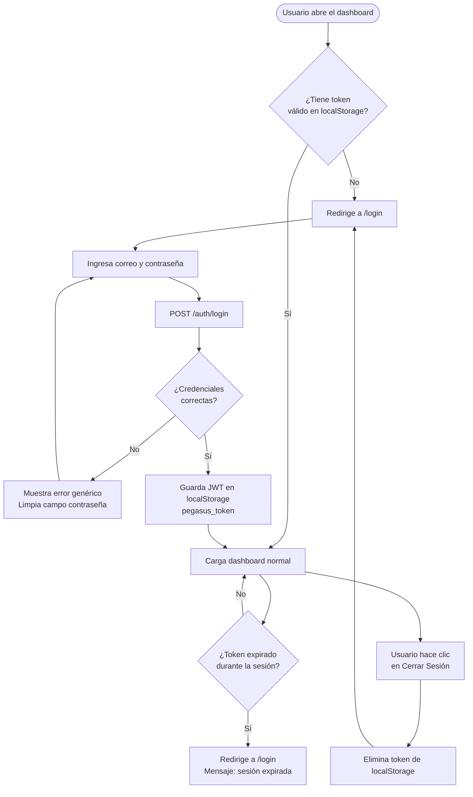

## Historia de Usuario

> **Como** administrador o team leader del programa Riwi,  
> **quiero** poder iniciar sesión de forma segura en el dashboard Pegasus,  
> **para** acceder a la información de asistencia de los coders y proteger los datos del sistema contra accesos no autorizados.

---

## Contexto del Negocio

Actualmente el dashboard es accesible sin ningún tipo de autenticación (solo una API Key estática en el código fuente). Existen dos tipos de usuarios:

- **Administrador**: acceso total a todos los clanes (Hamilton, Thompson, Nakamoto, Tesla, McCarty)
- **Team Leader**: acceso total a todos los clanes también (mismos permisos — rol diferenciado para uso futuro)

Ambos roles utilizarán la misma interfaz. La diferenciación de roles queda registrada en base de datos para futuras expansiones de permisos.

---

## Criterios de Aceptación

### AC-1: Página de Login

```
DADO QUE un usuario no autenticado accede a cualquier ruta del dashboard
CUANDO el sistema detecta que no existe un token JWT válido en localStorage
ENTONCES el sistema redirige automáticamente a /login
Y muestra un formulario con campos de correo electrónico y contraseña
```

### AC-2: Autenticación exitosa

```
DADO QUE un team leader ingresa su correo y contraseña correctos
CUANDO hace clic en "Iniciar sesión"
ENTONCES el sistema valida las credenciales contra la base de datos
Y retorna un JWT con expiración de 8 horas
Y almacena el token en localStorage bajo la clave "pegasus_token"
Y redirige al usuario al dashboard principal
Y muestra en la barra de navegación el nombre del usuario y su rol
```

### AC-3: Autenticación fallida

```
DADO QUE un usuario ingresa credenciales incorrectas
CUANDO hace clic en "Iniciar sesión"
ENTONCES el sistema retorna un error 401
Y muestra el mensaje "Correo o contraseña incorrectos" sin especificar cuál falló
Y NO bloquea la cuenta en esta versión (se registra el intento en logs)
Y el campo de contraseña se limpia automáticamente
```

### AC-4: Protección de contraseña

```
DADO QUE el sistema almacena una contraseña
ENTONCES NUNCA se almacena en texto plano
Y se utiliza hashing con bcrypt (cost factor mínimo 12)
Y la contraseña nunca viaja en respuestas de API
Y el campo de contraseña en el formulario siempre es de tipo "password"
```

### AC-5: Expiración y cierre de sesión

```
DADO QUE han pasado 8 horas desde el último login
CUANDO el usuario intenta hacer una petición a la API
ENTONCES el token devuelve 401 Unauthorized
Y el sistema redirige al usuario a /login automáticamente
Y muestra el mensaje "Tu sesión ha expirado, vuelve a iniciar sesión"
```

```
DADO QUE el usuario hace clic en "Cerrar sesión"
ENTONCES el token se elimina de localStorage
Y el usuario es redirigido a /login
```

### AC-6: Seguridad del token

```
DADO QUE el JWT es emitido por el backend
ENTONCES contiene como payload: { sub: correo, nombre, rol, clan_id, exp }
Y está firmado con una clave secreta (JWT_SECRET) almacenada en variables de entorno
Y la clave secreta NUNCA está hardcodeada en el código fuente
Y el algoritmo de firma es HS256 como mínimo
```

### AC-7: Protección de rutas del backend

```
DADO QUE cualquier endpoint de la API recibe una petición
CUANDO el header Authorization: Bearer <token> está ausente o es inválido
ENTONCES el sistema retorna 401 con mensaje "No autenticado"
Y NO retorna datos

DADO QUE el endpoint requiere autenticación y el token es válido
ENTONCES el sistema procesa la petición normalmente
```

### AC-8: Visibilidad de datos según rol

```
DADO QUE el usuario autenticado tiene rol "admin" o "team_leader"
CUANDO accede al dashboard
ENTONCES puede ver los datos de TODOS los clanes
Y puede filtrar por cualquier clan desde el selector de la navbar
```

---

## Reglas de Negocio

| # | Regla |
|---|---|
| RN-1 | El correo electrónico es case-insensitive (mayúsculas = minúsculas) |
| RN-2 | La contraseña mínima debe tener **8 caracteres**, al menos **1 número** y **1 mayúscula** |
| RN-3 | El token JWT expira a las **8 horas** (jornada laboral) |
| RN-4 | Un team leader puede ser líder de un único clan (relación 1:N clan → leaders) |
| RN-5 | El campo `password_hash` nunca se incluye en respuestas JSON |
| RN-6 | Las credenciales de primera vez son asignadas manualmente y deben cambiarse en el primer login *(versión futura)* |

---

## Especificación Técnica

### Stack a utilizar

| Componente | Tecnología |
|---|---|
| Hash de contraseña | `passlib[bcrypt]` (bcrypt, cost=12) |
| Firma JWT | `python-jose[cryptography]` (HS256) |
| Contexto frontend | React Context API (`AuthContext`) |
| Almacenamiento token | `localStorage` (`pegasus_token`) |
| Rutas protegidas | Componente `<ProtectedRoute>` en React |

### Nuevas dependencias — `requirements.txt`

```
python-jose[cryptography]==3.3.0
passlib[bcrypt]==1.7.4
```

### Nuevo endpoint — `POST /auth/login`

**Request:**
```json
{
  "correo": "tlider.hamilton@selvadescriptiva.com",
  "password": "MiClave2026"
}
```

**Response 200 OK:**
```json
{
  "access_token": "eyJhbGciOiJIUzI1NiIsInR5cCI6IkpXVCJ9...",
  "token_type": "bearer",
  "expires_in": 28800,
  "usuario": {
    "nombre": "Juan Pérez",
    "correo": "tlider.hamilton@selvadescriptiva.com",
    "rol": "team_leader",
    "clan": "Hamilton"
  }
}
```

**Response 401 Unauthorized:**
```json
{
  "detail": "Correo o contraseña incorrectos"
}
```

### Nueva migración de Alembic — tabla `team_leaders`

> [!IMPORTANT]
> La tabla `team_leaders` ya existe en `models.py` pero **NO fue incluida en la migración inicial** (`91fb7373e449`). Se requiere una nueva migración de Alembic para crearla en la base de datos de Railway.

Campos a crear:
- `id` INTEGER PK
- `nombre` VARCHAR(100) NOT NULL
- `correo` VARCHAR(100) UNIQUE NOT NULL
- `password_hash` VARCHAR(255) NOT NULL
- `rol` VARCHAR(50) NOT NULL → valores: `"admin"` | `"team_leader"`
- `clan_id` INTEGER FK → `clanes.id` NULLABLE (admin puede no tener clan)

### Nuevo script seed — `init_team_leaders.py`

Crea los usuarios iniciales con contraseñas temporales hasheadas:

| Nombre | Correo | Rol | Clan |
|---|---|---|---|
| Administrador Principal | admin@selvadescriptiva.com | admin | NULL |
| TL Hamilton | tl.hamilton@selvadescriptiva.com | team_leader | Hamilton |
| TL Thompson | tl.thompson@selvadescriptiva.com | team_leader | Thompson |
| TL Nakamoto | tl.nakamoto@selvadescriptiva.com | team_leader | Nakamoto |
| TL Tesla | tl.tesla@selvadescriptiva.com | team_leader | Tesla |
| TL McCarty | tl.mccarty@selvadescriptiva.com | team_leader | McCarty |

### Nueva variable de entorno — `.env`

```
JWT_SECRET=<clave-aleatoria-256-bits>
JWT_ALGORITHM=HS256
JWT_EXPIRE_HOURS=8
```

> [!CAUTION]
> `JWT_SECRET` NO debe ser commiteada a Git. Agregar al `.gitignore` si no está ya.

### Cambios en el frontend

```
web/src/
├── context/
│   └── AuthContext.jsx         ← NUEVO: proveedor global de sesión
├── pages/
│   └── LoginPage.jsx           ← NUEVO: pantalla de login
├── components/
│   └── ProtectedRoute.jsx      ← NUEVO: wrapper de rutas privadas
├── services/
│   └── api.js                  ← MODIFICAR: agregar token en cada request
└── App.jsx                     ← MODIFICAR: envolver en AuthContext y ProtectedRoute
```

---

## Flujo de Usuario



---

## Criterios de Definition of Done (DoD)

- [ ] La tabla `team_leaders` existe en la DB de Railway (migración ejecutada)
- [ ] Se puede hacer login con correo y contraseña desde el formulario
- [ ] Las contraseñas están hasheadas con bcrypt (verificable en DB)
- [ ] El JWT expira a las 8 horas
- [ ] Sin token válido, ninguna ruta del dashboard carga
- [ ] La API Key estática `mvp-test-key-123` ya NO es el único método de auth
- [ ] El `JWT_SECRET` está en `.env` y NO en el código fuente
- [ ] El campo `password_hash` no aparece en ninguna respuesta de la API
- [ ] El botón "Cerrar sesión" elimina el token y redirige
- [ ] El nombre del usuario logueado se muestra en la navbar

---

## Notas y Decisiones de Diseño

> [!NOTE]
> **API Key heredada**: Los endpoints actuales usan `X-API-Key`. Con el nuevo sistema, los endpoints se protegerán con JWT. La API Key puede mantenerse temporalmente para compatibilidad con scripts internos (`import_moodle.py`, etc.) o eliminarse gradualmente.

> [!TIP]
> **No implementar en este sprint**: recuperación de contraseña por email, bloqueo de cuenta por intentos fallidos, 2FA. Estos pueden ser historias de usuario independientes en sprints futuros.

> [!WARNING]
> El campo `clan_id` del token JWT permite que en el futuro un team leader pueda ser limitado a ver solo su clan con un solo cambio en el backend, sin tocar el frontend.
