# Hoja de Ruta: Implementación de Autenticación JWT

## Visión General
Implementación progresiva del sistema de autenticación JWT para Pegasus en 4 fases, con estimación de 3 días de desarrollo activo.

## Timeline Estimado

```mermaid
gantt
    title Timeline de Implementación - Autenticación JWT
    dateFormat  HH:mm
    axisFormat %H:%M
    
    section Fase 1: Configuración
    Verificar estado DB           :crit, a1, 00:00, 1h
    Configurar dependencias       :a2, after a1, 30m
    Variables entorno             :a3, after a2, 30m
    
    section Fase 2: Backend Auth
    Endpoint /auth/login          :crit, b1, after a3, 2h
    Utilidades JWT/bcrypt         :b2, after b1, 2h
    Migración team_leaders        :crit, b3, after b2, 1h
    Script seed usuarios          :b4, after b3, 1h
    Testing backend               :b5, after b4, 1h
    
    section Fase 3: Frontend Auth
    AuthContext & LoginPage       :crit, c1, after b5, 3h
    ProtectedRoute & routing      :c2, after c1, 2h
    Modificar api.js (JWT)        :c3, after c2, 1h
    Navbar con usuario/logout     :c4, after c3, 1h
    Testing frontend              :c5, after c4, 1h
    
    section Fase 4: Integración
    Proteger endpoints API        :crit, d1, after c5, 2h
    Testing integración           :d2, after d1, 2h
    Documentación                 :d3, after d2, 1h
    Deploy & validación           :crit, d4, after d3, 1h
```



## Fase 1: Configuración (Día 1 - Mañana)

### Objetivo
Preparar el entorno de desarrollo con todas las dependencias y configuraciones necesarias.

### Tareas
1. **Verificar estado de la base de datos** (1h)
   - [ ] Conectarse a DB de desarrollo/producción
   - [ ] Verificar si tabla `team_leaders` existe
   - [ ] Consultar estructura actual: `SELECT * FROM information_schema.tables WHERE table_name = 'team_leaders';`
   - [ ] Decidir: nueva migración vs ajuste de migración existente

2. **Configurar dependencias backend** (30m)
   - [ ] Agregar a `api/requirements.txt`:
     ```txt
     python-jose[cryptography]==3.3.0
     passlib[bcrypt]==1.7.4
     ```
   - [ ] Ejecutar `pip install -r requirements.txt` (o equivalente en Docker)

3. **Configurar variables de entorno** (30m)
   - [ ] Crear/actualizar `.env` con:
     ```env
     JWT_SECRET=<clave-aleatoria-256-bits>
     JWT_ALGORITHM=HS256
     JWT_EXPIRE_HOURS=8
     ```
   - [ ] Generar clave segura: `openssl rand -hex 32`
   - [ ] Actualizar `docker-compose.yml` si es necesario para propagar variables

### Entregables Fase 1
- ✅ Dependencias instaladas y verificadas
- ✅ Variables de entorno configuradas
- ✅ Decisión tomada sobre migración de DB
- ✅ Ambiente listo para desarrollo

---

## Fase 2: Backend Authentication (Día 1 - Tarde)

### Objetivo
Implementar el endpoint de login, utilidades JWT/bcrypt, y preparar la base de datos.

### Tareas
1. **Crear utilidades de seguridad** (2h)
   - [ ] Crear `api/app/core/security.py` con:
     - Función `create_access_token(data: dict, expires_delta: timedelta)`
     - Función `verify_password(plain_password, hashed_password)`
     - Función `get_password_hash(password)`
     - Función `verify_jwt_token(token: str) -> dict`
   - [ ] Configurar dependencia de JWT_SECRET desde variables de entorno

2. **Implementar endpoint `/auth/login`** (2h)
   - [ ] Crear `api/app/api/endpoints/auth.py`:
     - `POST /login` con validación de credenciales
     - Retorno de JWT y datos de usuario
     - Manejo de errores (401, 422)
   - [ ] Actualizar `api/app/api/router.py` para incluir auth router
   - [ ] Actualizar `api/app/api/__init__.py`

3. **Migración de base de datos** (1h)
   - [ ] Crear nueva migración Alembic:
     ```bash
     alembic revision --autogenerate -m "create_team_leaders_table"
     ```
   - [ ] Verificar que la migración cree tabla `team_leaders` con:
     - `id`, `nombre`, `correo`, `password_hash`, `rol`, `clan_id`
   - [ ] Ejecutar migración: `alembic upgrade head`

4. **Script seed de usuarios iniciales** (1h)
   - [ ] Crear `api/scripts/init_team_leaders.py`:
     - Hash de contraseñas con bcrypt
     - Insertar 6 usuarios (1 admin + 5 team leaders)
     - Contraseña temporal: `TempPass2026!`
   - [ ] Ejecutar script y verificar inserción

5. **Testing backend** (1h)
   - [ ] Probar endpoint con curl/Postman:
     ```bash
     curl -X POST http://localhost:8000/api/v1/auth/login \
       -H "Content-Type: application/json" \
       -d '{"correo":"tl.hamilton@selvadescriptiva.com","password":"TempPass2026!"}'
     ```
   - [ ] Verificar token JWT válido
   - [ ] Probar token expirado/inválido

### Entregables Fase 2
- ✅ Endpoint `/auth/login` funcional
- ✅ Token JWT generado y verificado correctamente
- ✅ Tabla `team_leaders` creada en DB
- ✅ Usuarios iniciales insertados
- ✅ Testing manual exitoso

---

## Fase 3: Frontend Authentication (Día 2)

### Objetivo
Implementar la autenticación en el frontend: login, protección de rutas, y gestión de sesión.

### Tareas
1. **Crear AuthContext** (1.5h)
   - [ ] Crear `web/src/context/AuthContext.jsx`:
     - Estado global: `{ user, token, isLoading }`
     - Funciones: `login(email, password)`, `logout()`, `checkAuth()`
     - Efecto para verificar token en localStorage al cargar
     - Interceptor para agregar token a requests

2. **Implementar LoginPage** (1.5h)
   - [ ] Crear `web/src/pages/LoginPage.jsx`:
     - Formulario con campos: correo, contraseña
     - Validación básica (email format, password requirements)
     - Manejo de estados: loading, error, success
     - Integración con AuthContext.login()
   - [ ] Estilos básicos (puede reusar estilos existentes)

3. **Configurar React Router** (1h)
   - [ ] Instalar `react-router-dom` si no está (ya está en package.json)
   - [ ] Crear `web/src/components/ProtectedRoute.jsx`:
     - Wrapper que redirige a login si no autenticado
     - Manejo de loading state
   - [ ] Modificar `web/src/App.jsx`:
     - Envolver en `BrowserRouter`
     - Definir rutas: `/login`, `/dashboard` (protegida)
     - Redirección automática de `/` a `/dashboard` si autenticado

4. **Modificar servicios API** (1h)
   - [ ] Actualizar `web/src/services/api.js`:
     - Remover API key hardcodeada
     - Agregar token JWT a headers: `Authorization: Bearer ${token}`
     - Manejo automático de 401 responses (logout)
   - [ ] Actualizar todas las llamadas existentes para usar nuevo sistema

5. **Actualizar Navbar** (1h)
   - [ ] Modificar `web/src/components/Navbar.jsx`:
     - Mostrar nombre del usuario logueado
     - Agregar botón "Cerrar sesión"
     - Integrar con AuthContext.logout()
     - Ocultar/mostrar elementos según autenticación

6. **Testing frontend** (1h)
   - [ ] Probar flujo completo: login → dashboard → logout
   - [ ] Verificar redirección sin token
   - [ ] Probar token expirado (simular con token viejo)
   - [ ] Validar que API calls incluyen token

### Entregables Fase 3
- ✅ Login funcional en frontend
- ✅ Rutas protegidas correctamente
- ✅ Token persistido en localStorage
- ✅ Navbar muestra usuario y logout
- ✅ API calls con JWT en headers

---

## Fase 4: Integración y Deploy (Día 3)

### Objetivo
Integrar autenticación con endpoints existentes, testing completo, y despliegue.

### Tareas
1. **Proteger endpoints de la API** (2h)
   - [ ] Modificar `api/app/api/dependencies.py`:
     - Crear `verify_jwt_token` dependency
     - Mantener `verify_api_key` como fallback para compatibilidad
   - [ ] Actualizar routers existentes para usar JWT:
     ```python
     # En cada router, agregar:
     dependencies=[Depends(verify_jwt_token)]  # O mantener ambos
     ```
   - [ ] Loggear warnings cuando se use API key (deprecation)

2. **Testing de integración** (2h)
   - [ ] Probar flujo end-to-end:
     - Login frontend → token → request a endpoint protegido
     - Verificar que datos se muestran correctamente
   - [ ] Probar compatibilidad con scripts existentes:
     - Scripts que usan API key deben seguir funcionando
   - [ ] Probar edge cases:
     - Token malformado
     - Token expirado
     - Usuario no existente en DB

3. **Documentación** (1h)
   - [ ] Actualizar `QUICKSTART.md` con:
     - Nuevos pasos de configuración
     - Credenciales iniciales
     - Troubleshooting común
   - [ ] Actualizar `README.md` con información de autenticación
   - [ ] Crear `API_AUTH.md` con especificación de endpoints auth (opcional)

4. **Deploy y validación** (1h)
   - [ ] Ejecutar migración en entorno de producción
   - [ ] Ejecutar script seed en producción
   - [ ] Configurar variables de entorno en producción
   - [ ] Verificar que todo funciona en producción
   - [ ] Monitorear logs por errores

### Entregables Fase 4
- ✅ Todos los endpoints protegidos con JWT
- ✅ Compatibilidad mantenida con API key
- ✅ Testing integral completado
- ✅ Documentación actualizada
- ✅ Sistema desplegado y funcional en producción

---

## Dependencias Críticas

### Infraestructura
1. **Base de datos PostgreSQL** accesible
2. **Variables de entorno** configuradas en todos los entornos
3. **Docker** funcionando correctamente (si se usa)

### Conocimientos Requeridos
- Python/FastAPI (backend team)
- React/JavaScript (frontend team)
- JWT concepts (ambos equipos)
- Alembic migrations (backend)

### Riesgos y Contingencias

| Riesgo | Probabilidad | Impacto | Mitigación |
|--------|-------------|---------|------------|
| Tabla team_leaders ya existe con estructura diferente | Media | Alto | Verificar antes de migrar, script de migración condicional |
| React Router conflictos con App.jsx actual | Alta | Medio | Implementar routing minimal, no reescribir toda la app |
| Token JWT no funciona en producción | Baja | Alto | Testing exhaustivo en staging, rollback plan |
| Usuarios no pueden loguearse | Media | Alto | Script de recovery, credenciales de backup |

---

## Métricas de Éxito Post-Implementación

1. **Funcionalidad**: 100% de los usuarios iniciales pueden loguearse
2. **Performance**: Login response < 500ms (p95)
3. **Seguridad**: Zero credenciales hardcodeadas en código fuente
4. **Compatibilidad**: Scripts existentes siguen funcionando
5. **Usabilidad**: Usuarios comprenden flujo de login/logout

---

## Notas de Implementación

### Orden Recomendado de Ejecución
1. **Backend primero**: Sin backend funcional, frontend no puede probarse
2. **Migración DB temprano**: Evita conflicts con datos existentes
3. **Frontend después**: Una vez /auth/login funciona
4. **Integración final**: Conectar todo y probar completamente

### Decisiones de Diseño Pendientes
1. ¿Mantener API key indefinidamente o eliminar en próximo sprint?
2. ¿Implementar refresh tokens o solo access tokens?
3. ¿Almacenar token en cookies vs localStorage?
   - **Decisión actual**: localStorage (más simple para SPA)
   - **Considerar para producción**: HttpOnly cookies + CSRF protection

### Próximos Pasos Después de Esta Implementación
1. **Sprint siguiente**: Cambio de contraseña obligatorio en primer login
2. **Sprint +2**: Recuperación de contraseña por email
3. **Sprint +3**: Roles diferenciados y permisos por clan
4. **Sprint +4**: Audit logging de acciones de usuarios

---

**Última Actualización**: 15/04/2026  
**Versión**: 1.0  
**Estado**: Pendiente de ejecución  
**Responsable**: Equipo de Desarrollo Pegasus